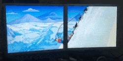

# Videowall

[](https://travis-ci.org/reinzor/videowall)



Video wall with multiple tiles that enables synchronized video playback, mirrored or tiled.

## Demo videos

| Description              |  Video                   |
:-------------------------:|:-------------------------:
6x RPI Zero - 720p - Big bug bunny | [](https://www.youtube.com/watch?v=f5Dp35RL9q8&t=6s)
2x RPI Zero - 720p - Big bug bunny | [](https://www.youtube.com/watch?v=J6anLNTHhKU&t=6s)
2x RPI Zero - 720p - Simpsons | [](https://www.youtube.com/watch?v=LbjiZv7XG90)
4x RPI Zero + laptop - 720p - Fantastic 4 | [](https://www.youtube.com/watch?v=6yAyf_zFOXs)

## Installation

### Software

#### Raspberry PI

##### Installation prerequisites

- Raspbian Stretch Lite
- Raspberry Pi 3 / Raspberry Pi Zero (other Pi's not tested)
- Videowall repository is your current working directory

##### Installation from source

- Install Raspbian Stretch lite on an sd card of at least 4GB
- Place an `ssh` document in the `/boot` partition to enable direct ssh access
- Login to the raspberry pi and start the installation:

```
sudo apt-get -y update && \
sudo apt-get -y install git && \
git clone https://github.com/reinzor/videowall.git && cd videowall && \
./install_raspberry_pi_stretch_lite_autostart.bash
```

This installs the videowall software and enables a client service on startup.

#### Ubuntu x86

##### Installation prerequisites

- Ubuntu x86 16.04 LTS (other versions not tested)
- Videowall repository is your current working directory

##### Installation

```
./install_ubuntu_x86.bash
```

### Hardware

#### Raspberry PI

##### Components per client without cables

- [Raspberry PI zero](https://www.adafruit.com/product/2885)
- [Micro USB 2.0 naar Ethernet 10/100 RJ45 Network Lan Adapter Card](https://nl.banggood.com/Micro-USB-2_0-to-Ethernet-10-or-100-RJ45-Network-Lan-Adapter-Card-p-921585.html)
- 4GB+ Micro SD card

Cost `~15 USD` per client

### Quick start

Make sure you have sources the `setup.bash` from the root directory. This will set the Gstreamer plugin paths and appends the videowall library to your `PYTHONPATH`.

#### Server

    scripts/web_server

#### Client

    scripts/client

This is automatically started on a raspberry pi after installation. Can be manually started on an ubuntu x86 environment.

### How to create release image

- Create a git tag and update release notes
- Ensure new MAC generation on startup

```bash
sudo rm -f /etc/network/mac
```

- Create `.img` file on Ubuntu host computer (insert sd card):

```bash
sudo fdisk -l # Get the disk name of the sd card
sudo dd bs=4M if=/path/to/disk of=/path/to/image.img
```

- Shrink the image using [pishrink.sh](https://raw.githubusercontent.com/Drewsif/PiShrink/master/pishrink.sh)

```bash
sudo ./pishrink.sh /path/to/image.img /path/to/shrinked_image.img
```

- Create a `tar.gz` from image file:

```
Right click, compress, tar.gz
```

## References

- [Cinder GST Sync Player](https://github.com/patrickFuerst/Cinder-GstVideoSyncPlayer)
- [Override getty1](https://raymii.org/s/tutorials/Run_software_on_tty1_console_instead_of_login_getty.html)
- [Vigsterkr pi-wall](https://github.com/vigsterkr/pi-wall)
- [Gstreamer mmal for smooth video playback on RPI](https://gstreamer.freedesktop.org/data/events/gstreamer-conference/2016/John%20Sadler%20-%20Smooth%20video%20on%20Raspberry%20Pi%20with%20gst-mmal%20(Lightning%20Talk).pdf)
- [Gstreamer sync server for synchronized playback on multiple client with a gstreamer client server set-up](https://github.com/ford-prefect/gst-sync-server)
- [Multicast Video-Streaming on Embedded Linux Environment, Daichi Fukui, Toshiba Corporation, Japan Technical Jamboree 63, Dec 1st, 2017](https://elinux.org/images/3/33/Multicast_jamboree63_fukui.pdf)
- [omxplayer-sync](https://github.com/turingmachine/omxplayer-sync)
- [pwomxplayer](https://github.com/JeffCost/pwomxplayer)
- [dbus vlc](https://wiki.videolan.org/DBus-spec/)
- [dbus tutorial phython for MPRIS](http://amhndu.github.io/Blog/python-dbus-mpris.html)
- [dbus omxplayer](https://github.com/popcornmix/omxplayer)
- [GPU memory 90 degrees omxplayer](https://github.com/popcornmix/omxplayer/issues/467)
- [Remote dbus control](https://stackoverflow.com/questions/10158684/connecting-to-dbus-over-tcp/13275973#13275973)
- [GST OMX](https://github.com/GStreamer/gst-omx)
- [GST MMAL](https://github.com/youviewtv/gst-mmal)
- [Disable Boot text](https://retropie.org.uk/docs/FAQ/#how-do-i-hide-the-boot-text)
